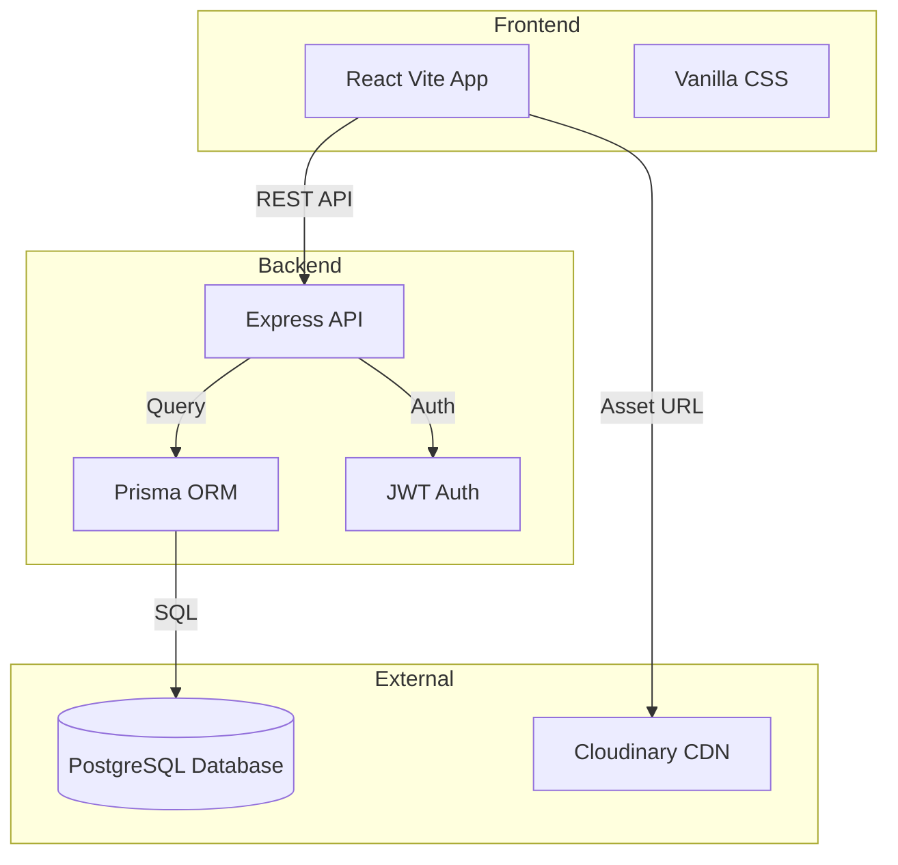
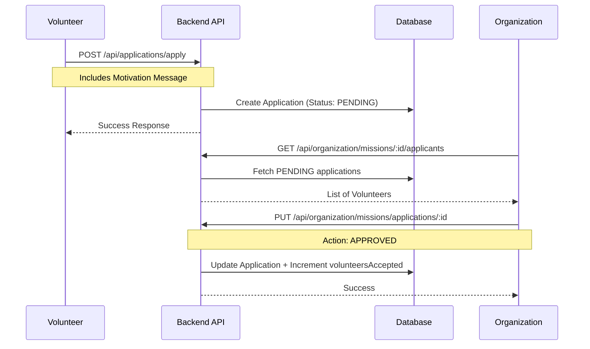
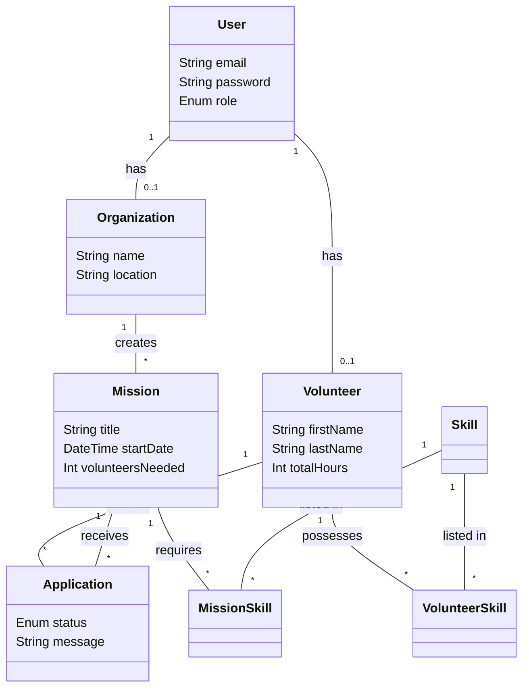

# UML Documentation - DZ Volunteer

This document contains the UML diagrams representing the system architecture and logic.

## 1. Use Case Diagram
Describes the interactions between the different actors and the system.

```mermaid
useCaseDiagram
    actor "Volunteer" as V
    actor "Organization" as O
    actor "Administrator" as A

    V --> (Search Missions)
    V --> (Apply to Mission)
    V --> (Manage Profile & Skills)
    
    O --> (Create/Edit Mission)
    O --> (Approve Application)
    O --> (Validate Volunteering Hours)
    
    A --> (Verify Skills)
    A --> (Delete Users)
```

## 2. Component Diagram
Shows the high-level architecture of the application.



## 3. Sequence Diagram (Mission Application)
Shows the process of a volunteer applying for a mission and getting approved.



## 4. Class Diagram (Data Model)
Visual representation of the Prisma schema.


